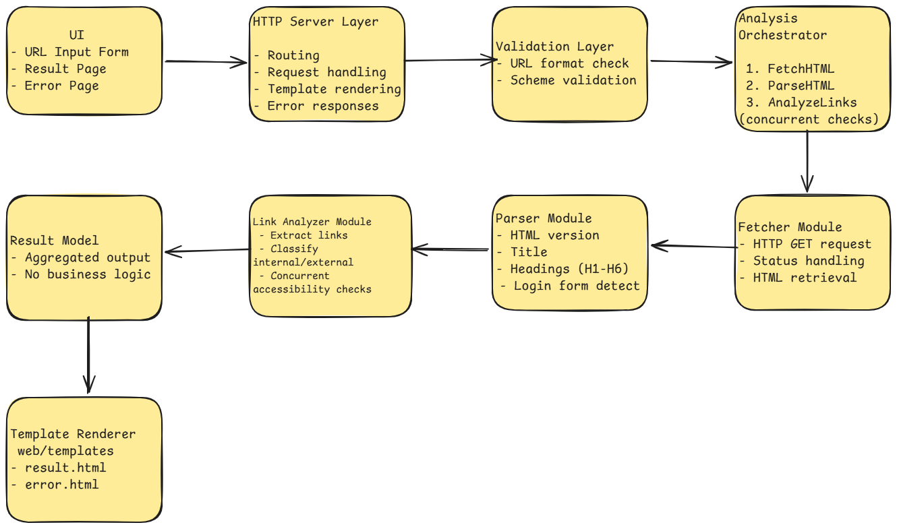

# Web Page Analyzer

## Project Overview

A Go-based web application that analyzes a given web page URL and extracts
structural and accessibility information.

- HTML version
- Page title
- Head Tags counts (h1–h6)
- Internal vs External links counts
- Inaccessible links counts
- Login form detection

## Prerequisites

- Go 1.25.6+ version

## Build

- Clone the repository:
```
git clone <repository-url>
cd web-page-analyzer
```

- Install dependencies:
```
go mod tidy
```

- Build the application:
```
go build ./cmd/webanalyzer
```

## Run

```
go run ./cmd/webanalyzer
```
Access application:
```
http://localhost:8080
```

## Deployment (Docker)

Build Docker image:
```
docker build -t web-page-analyzer .
```

Run container:
```
docker run -p 8080:8080 web-page-analyzer
```

## Testing

Run unit tests:
```
go test ./... -cover
```

## Project Structure
```
web-page-analyzer/
─ cmd/webanalyzer        # Application entry point
─ internal/server        # HTTP server and routing
─ internal/analyzer      # Core analysis logic
─ internal/validator     # URL validation
─ internal/model         # Data models
─ web/templates          # HTML templates
─ web/static             # CSS
```

## Architecture Diagram



*High-level architecture of the Web Page Analyzer application*


## Core Features

- Accepts a web page URL via a simple web interface.
- Validates URL format and scheme (`http` / `https`).
- Fetches HTML content with proper timeouts and error handling.
- Detects HTML version (e.g., HTML5, HTML 4.01).
- Extracts page title.
- Counts headings by level (H1–H6).
- Classifies links as internal or external.
- Checks link accessibility concurrently to improve performance.
- Reports number of inaccessible links.
- Detects presence of a login form.
- Displays analysis results in a readable UI.
- Shows error pages with HTTP status codes when a URL is unreachable.

## API Specifications

### GET /

Displays the landing page with a form to submit a URL for analysis.

**Response**
- HTML page containing URL input form

---

### POST /analyze

Triggers analysis of the submitted URL and renders the result page.

**Request Parameters (form data)**

- Name: url
- Type: string
- Description: Fully qualified URL (http/https)

**Success Response**
- Renders analysis result page containing:
  - HTML version
  - Page title
  - Heading counts
  - Internal / External link counts
  - Inaccessible link count
  - Login form presence

**Error Response**
- Renders error page containing:
  - HTTP status code
  - Descriptive error message

**Notes**
- URL validation is performed before analysis
- Network and parsing errors are handled gracefully

## Observability

The application is designed with observability in mind, focusing on clarity and debuggability.

### Logging
- Uses standard Go logging practices
- Errors are logged at the point of failure
- User-facing errors are separated from internal error handling

### Metrics (Future Improvement)
- Prometheus metrics can be added to track:
  - Request count
  - Analysis duration
  - Error rates
- Metrics endpoint (e.g., `/metrics`) can be exposed if required

### Profiling (Future Improvement)
- Go `pprof` can be enabled to analyze:
  - CPU usage
  - Memory allocation
  - Goroutine behavior

### Error Visibility
- HTTP status codes are preserved and shown to the user
- Network and parsing failures provide meaningful messages

## Usage

1. Enter a valid URL - start with http:// or https://
2. Click Analyze
3. View analysis results:
   - HTML version
   - Title
   - Headings
   - Link statistics
   - Login form detection

4. If the page is not reachable, an error page displays the HTTP status code and message.

## Technologies Used

Backend
- Golang (net/http, context, sync, net/url)
- goquery (HTML parsing)

Frontend
- HTML
- CSS

## Assumptions

- Internal links are defined as same host or relative paths.
- External links are pointing to different hosts.

## Challenges & Decisions

- Handling link classification in tests where localhost hosts share names.
- Ensuring concurrency without race conditions using WaitGroup and Mutex.
- Balancing coverage with meaningful tests.

## Possible Improvements

- Display list of inaccessible links.
- Limit concurrency using worker pool.
- Add Prometheus metrics and pprof profiling.
- Add result export (JSON, csv)